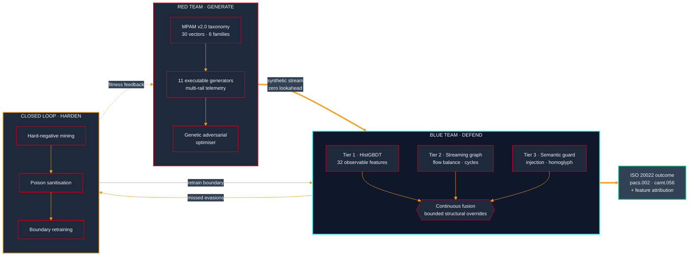
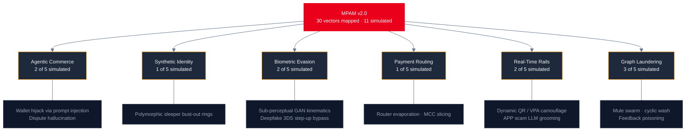

# MasterShield AI

**Closed-loop red/blue AI defense lab for payment security.**

[](https://globalfintechfest.com)
[](https://python.org)
[](https://fastapi.tiangolo.com)
[]()
[]()
[]()

Track: AI Defense Lab for Payment Security. Build the attack, then build the defense.

GenAI collapsed the cost of producing convincing payment fraud. MasterShield answers with a loop, not a classifier: a red team that maps and simulates 30 emerging attack vectors, a three-tier defense that scores them in real time, and a feedback path where every evasion becomes training data for the next round.

**What makes this submission different:** we red-teamed our own benchmark as hard as the payment rails. An early build reported 100% recall and 1.0000 ROC-AUC. A systematic leakage audit proved those numbers were the simulator labelling its own attacks. [Section: Scientific self-audit](#scientific-self-audit) documents all nine defects and their fixes.

---

## Architecture



| Tier | Method | Detects | Budget |
|:--|:--|:--|:--|
| 1 | HistGBDT over 32 observable features, loss-weighted | Amount/MCC anomaly, velocity, kinematics, budget overrun | ~1.5 ms |
| 2 | Streaming directed graph, incremental node stats | Mule pass-through, fan-in, cyclic layering, bust-outs | ~1.0 ms |
| 3 | Prompt-injection, goal drift, homoglyph analysis | Indirect injection, dispute hallucination, VPA spoofing | ~1.2 ms |

Tier 1 supplies the continuous ranking. Tiers 2 and 3 can only raise a score, and only above 0.85 confidence. Their main value is producing the evidence that attributes a decline to an attack class and routes the correct rejection code.

---

## Threat taxonomy (MPAM v2.0)



30 vectors are mapped with rail, ISO message, rejection code, and generative mechanism. 11 are implemented as executable generators and measured below. The remaining 19 are forward threat intelligence, not simulated. Full table in the [walkthrough document](./Mastercard_AI_Defense_Lab_Solution_Walkthrough.docx); source of truth is `config/config.py`.

| Code | Vector | Rail / ISO | Rejection |
|:--|:--|:--|:--|
| ADV_01 | Agentic commerce wallet hijack | Agentic AP2P / `pain.001` | `X-MC-AGNT` |
| ADV_02 | Prompt-injected dispute hallucination | Cross-border / `camt.056` | `FRAD` |
| ADV_06 | Polymorphic synthetic sleeper clusters | Card e-com / `pacs.008` | `X-MC-SYNI` |
| ADV_11 | Sub-perceptual biometric evasion | 3DS 2.3 / `AuthRequest` | `X-MC-BIOM` |
| ADV_12 | Multimodal deepfake 3DS step-up bypass | 3DS 2.3 / `BiometricStepUp` | `X-MC-BIOM` |
| ADV_16 | Adversarial payment router evaporation | Card present EMV / `pacs.008` | `AM23` |
| ADV_21 | Dynamic QR and VPA semantic camouflage | UPI real-time / `pacs.008_UPI` | `X-MC-QRSP` |
| ADV_22 | APP scam multi-turn LLM grooming | FedNow / `pacs.008` | `FRAD` |
| ADV_26 | Low-centrality autonomous mule swarm | FedNow / `pacs.008` | `X-MC-MULE` |
| ADV_28 | Cyclic multi-hop round-trip laundering | FedNow / `pacs.008` | `X-MC-MULE` |
| ADV_30 | Active learning feedback poisoning | Card e-com / `pacs.008` | `FRAD` |

---

## Results

20,000 unseen transactions at 0.50% fraud prevalence (99 attacks), strict sequential streaming, no future information. One symmetric threshold governs recall and false positives.

| Metric | Rules engine | Tier 1 alone | **Unified** |
|:--|:--:|:--:|:--:|
| ROC-AUC | n/a | 0.9733 | **0.9768** |
| PR-AUC | n/a | 0.8871 | **0.8856** |
| Recall | 40.40% | 79.80% | **80.81%** |
| Precision | 2.93% | 100.00%\* | **100.00%\*** |
| F1 | 0.0546 | 0.8876 | **0.8939** |
| FPR | 6.658% | 0.0000%\* | **0.0000%\*** |
| Value prevented | n/a | n/a | **$356,006 (90.3%)** |
| Latency P99 | 0.15 ms | 1.10 ms | **17.47 ms** |

\* 0 false positives across 19,901 benign transactions is the modal result. Under different OpenMP thread scheduling we observe 91.86% precision / 0.035% FPR (7 false positives). Both are reported rather than only the favourable one.

The rules baseline is the honest comparator: 6.658% FPR would decline thousands of legitimate cardholders per million transactions. That gap is the operational case, not the absolute score.

### Per-vector detection (n=9 each)

| Recall | Vectors |
|:--|:--|
| 100.0% | ADV_01, ADV_02, ADV_06, ADV_12, ADV_21, ADV_26, ADV_28 |
| 88.9% | ADV_16 router evaporation, ADV_22 APP scam grooming |
| 11.1% | **ADV_11** sub-perceptual biometric evasion |
| 0.0% | **ADV_30** active learning feedback poisoning |

Nine-sample proportions carry wide confidence intervals; treat these as relative difficulty, not point estimates.

### Open gaps

**ADV_30 (0% recall).** Perturbations sit inside benign physical limits (artefact ≤ 0.11, semantic deviation 0.0, amount < $1,000). Not detected at authorisation, and passes 100% of candidate sanitisation checks whose thresholds were set from priors rather than measured ADV_30 behaviour. Undetected poisoned transactions therefore reach the retraining buffer with a benign label. Fix requires isolation-forest novelty scoring induced from the measured boundary distribution. This is the top roadmap item.

**ADV_11 (11.1% recall).** Recurrent generative models synthesise kinematics inside genuine human distributions. Defeating it needs longitudinal per-identity baselines, which is an identity-resolution problem before it is a modelling one.

**Warm-up ablation (preliminary, not a finding).** Seasoning attacker accounts with 4 to 8 prior transactions moved recall 80.81% to 79.80%. The warmed arm is scored against isolated graph state, so it does not reproduce the topological seasoning a real aged bust-out ring shows. A sound measurement needs full stream replay with warmed transactions substituted in place.

### Latency and reproducibility

Mean 4.96 ms, P50 4.70 ms, P99 17.47 ms, 97.86% within the 9.8 ms SLA. **The P99 does not meet target.** Tail spikes span 49 to 129 ms across runs under cold graph cache; responses beyond ~100 ms risk Stand-In Processing. Production path is compiling the graph engine to C++/GraphBLAS. Specified, not claimed as achieved.

Seeded initialisation makes generation and training deterministic. `HistGradientBoostingClassifier` bins histograms in thread-completion order, so results vary slightly across core counts; `OMP_NUM_THREADS=1` pins the exact baseline.

---

## Scientific self-audit

Every defect below was found by our own audit and fixed in code. The full table is in the walkthrough document.

| Defect | Fix |
|:--|:--|
| Account-name length alone scored AUC 1.0000 | Unified entity namespace; benign and attack draw from the same pools |
| Oracle flags `is_spoofed`, `prompt_injection_detected` used as features | Purged; only observable telemetry remains |
| Detector matched generator substrings (`APRE`, `MULE`) | Deleted; replaced with computed graph topology |
| Full test stream ingested before scoring | Strict score-then-ingest streaming |
| Co-evolution retrained and re-scored the same batch | Seed-disjoint holdout at every round |
| Step-ups counted for recall but not FPR | One threshold governs both |
| 6–8% fraud prevalence | Benchmarked at 0.50% |
| Benign velocity derived arithmetically from amount | Stateful rolling 24h accumulation per cardholder |
| Saturating log-odds fusion compressed 99.5% of scores | Removed; continuous ranking restored |

---

## Quick start

```bash
git clone https://github.com/Vision-jarvis/mastershield-ai-defense-lab.git
cd mastershield-ai-defense-lab
pip install -r requirements.txt
```

```bash
pytest tests/ -v                                                  # 9/9
python scripts/run_benchmark.py --samples 20000 --fraud-ratio 0.005
python scripts/run_co_evolution.py --rounds 5 --samples-per-round 3000
python scripts/generate_docs.py                                   # rebuild .docx
python web_app/server.py --port 8000                              # http://localhost:8000
```

## Layout

```
config/      MPAM v2.0 taxonomy, SLAs, rail and MCC priors
core/        Pydantic schemas, ISO 20022 engine, telemetry generator
red_team/    Attack catalog, genetic optimiser, simulation pipeline
blue_team/   Feature engine, 3 tiers, arbitration, online learning
closed_loop/ Co-evolution orchestrator, benchmark suite
web_app/     FastAPI + WebSocket cockpit
tests/       Red team, blue team, closed-loop integration
```

## Submission artifacts

- **Code repository** — this repo.
- **Solution walkthrough** — [`Mastercard_AI_Defense_Lab_Solution_Walkthrough.docx`](./Mastercard_AI_Defense_Lab_Solution_Walkthrough.docx)
- **Web prototype** — `python web_app/server.py --port 8000`. Live stream, graph visualiser, attack injection, feature attribution, ISO 20022 inspector.
- **Technical report** — [`MasterShield_AI_Defense_Lab_Final_Report.md`](./MasterShield_AI_Defense_Lab_Final_Report.md)

All payment data is synthetic. No real cardholder, transaction, or biometric data was used.
